# API-Banco-Digital

## Como Usar

1. Clone o Repositório
   * Clone este repositório para o seu computador usando o seguinte comando:
     ```bash
     $ git clone git@github.com:novvais/API-Banco-Digital.git

2. Encontre o Diretorio
   * Encontre o diretorio usando o código abaixo:
     ```bash
     $ cd API-Banco-Digital
     
3. Baixe todas as Dependecias do Projeto
   * No terminal utilize o código abaixo para baixar todas as bibliotecas:
     ```bash
     $ npm i

4. Inicie o Servidor
   * Inicie o servidor usando o código:
     ```bash
     $ npm run dev

5. Para executar as rotas utilize o Insomnia ou um programa similiar
   * Baixe e instale o Insomnia acessando o link: https://insomnia.rest/download
   * Crie uma conta e se conecte no aplicativo
      
## Como Usar o Insomnia

1. Na página incial do Insomnia, clique no ícone de + no canto superior direito
   <div>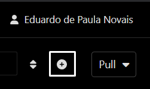</div>

2. Clique na primeira opção
   <div>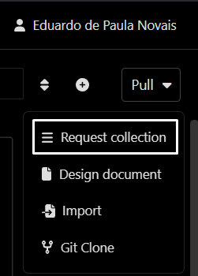</div>

3. Dê um nome para a coleção
   <div>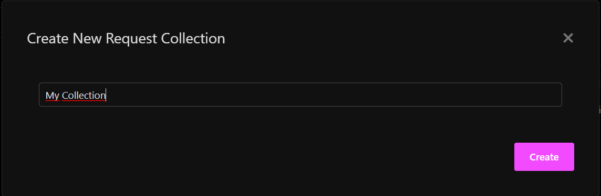</div>

4. Clique no ícone de + para criar uma rota
   <div>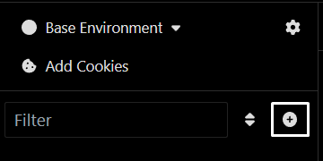</div> 

5. Clique na primeira opção
   <div>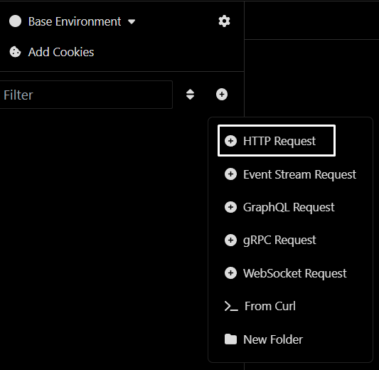</div>

6. Escolha o verbo da rota
   * Adicione o domínio e o caminho da API
     ```bash
     http://localhost:3000
   <div>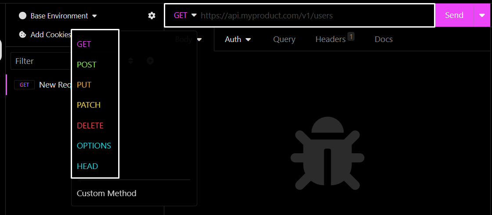</div>

7. Para testar a rota "listarConta" necessita adicionar a senha do banco do usuario
   <div>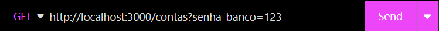</div>

8. Para testar as rotas "consultaDoSaldo" e "extrato" necessita adicionar o número da conta e senha do banco
   <div>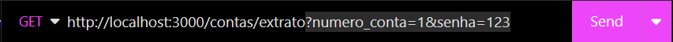</div>
   
#### Exemplo de conteúdo do Body Request
   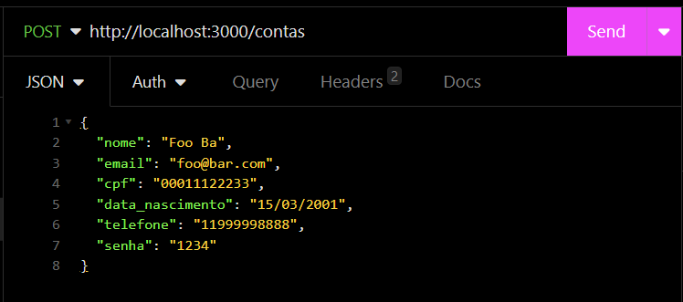

#### Exemplo de saída 
   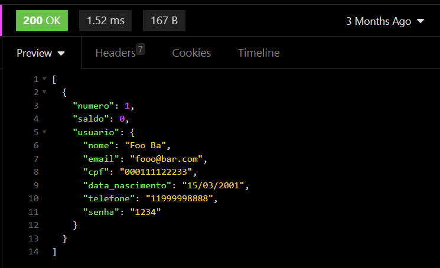

## Explicando as rotas

1. Rota **"listarContas"** - *Obrigatório o uso da query*
   * Adicione o dominio e o caminho da API
      ```bash
      http://localhost:3000/contas?senha_banco=123

   <div></div>

2. Rota **"adicionandoConta"** *Obrigatório o uso do body request*
   * Adicione o dominio e o caminho da API
      ```bash
      http://localhost:3000/contas
   * Adicione os dados que for adicionar no body
   <div>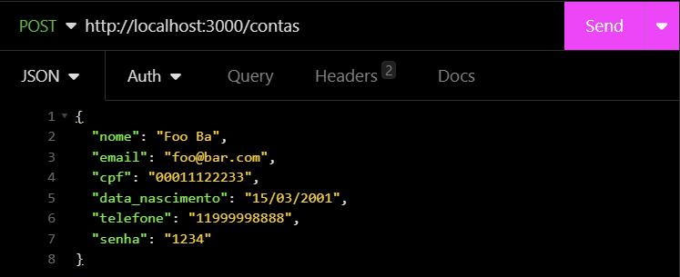</div>

3. Rota **"atualizarConta"** - *Obrigatório o uso do params e body request* 
   * Adicione o dominio e o caminho da API
      ```bash
      http://localhost:3000/contas/1/usuario
   * Adicione os dados que for atualizar no body
   <div>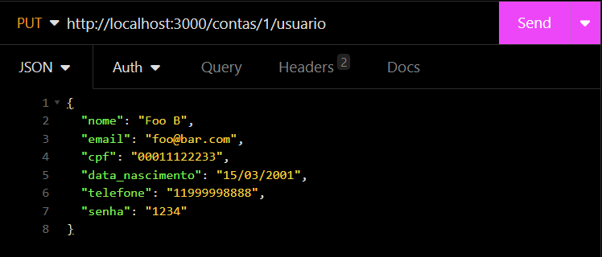</div>

4. Rota **"exclurConta"** - *Obrigatório o uso do params*
   * Adicione o dominio e o caminho da API
      ```bash 
      http://localhost:3000/contas/2
   <div>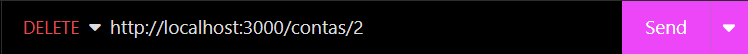</div>

5. Rota **"deposito"** - *Obrigatório o uso do body request*
   * Adicione o dominio e o caminho da API
      ```bash 
      http://localhost:3000/transacoes/depositar
   * Adicione o "numero_conta" e "valor" no body
   <div>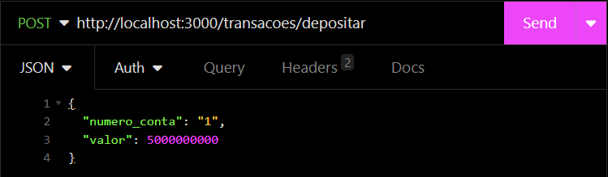</div>\

6. Rota **"saque"** - *Obrigatório o uso do body request*
   * Adicione o dominio e o caminho da API
      ```bash 
      http://localhost:3000/transacoes/sacar
   * Adicione o "numero_conta", "valor" e "senha" no body
   <div>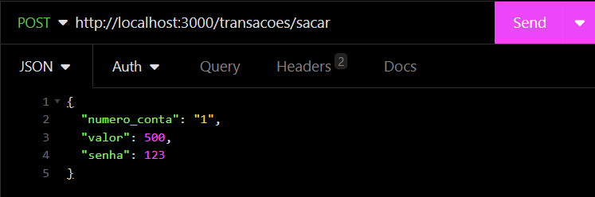</div>

7. Rota **"transferir"** *Obrigatório o uso do body request*
   * Adicione o dominio e o caminho da API
      ```bash 
      http://localhost:3000/transacoes/transferir
   * Adicione o "numero_conta_origem", "numero_conta_destino", "valor" e "senha" no body
      * numero_conta_origem = Número da conta de quem vai enviar o dinheiro
      * numero_conta_desino = Número da  cnta de quem vai receber o dinheiro
   <div>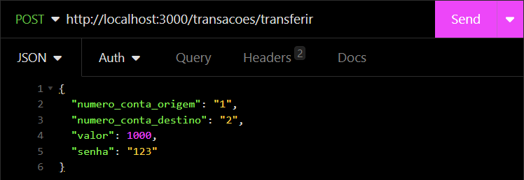</div>

8. Rota **"consultaDoSaldo"** - *Obrigatório o uso da query*
   * Adicione o dominio e o caminho da API
      ```bash 
      http://localhost:3000/contas/saldo?numero_conta=1&senha=123
   * Adicione o "numero_conta" e "senha" no caminho utilizando "?" após a URL básica
   <div></div>

8. Rota **"extrato"** - *Obrigatório o uso da query*
   * Adicione o dominio e o caminho da API
      ```bash 
      http://localhost:3000/contas/extrato?numero_conta=1&senha=123
   * Adicione o "numero_conta" e "senha" no caminho utilizando "?" após a URL básica
   <div></div>

### Fim